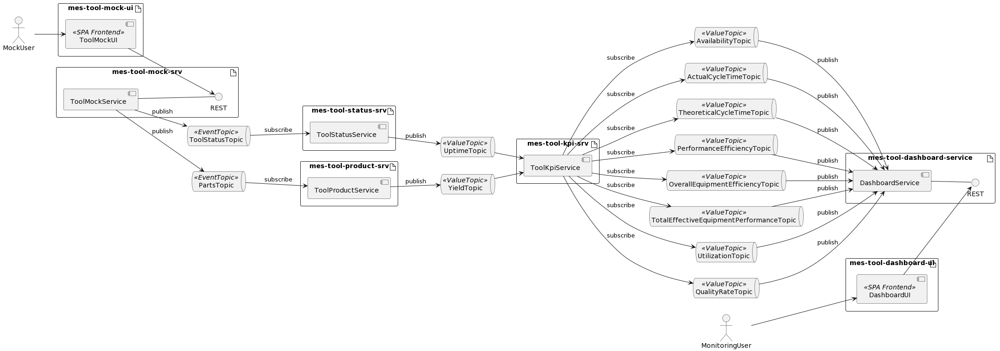

# mes-tool-dashboard-srv
A microservice to provide dashboard data for tools.

The ```DashboardService``` subscribes to various KPI value topics in the **`mes-bus`** and aggregates them to data that can be loaded by a dashboard. It provides various REST enpoints for that purpose. It may interface to a **`mes-tool-dashboard-db`** data base to maintain the aggregated state, or it may follow the event sourcing pattern to do so, omitting a database (to be decided).

## Fit Into Overall Architecture


